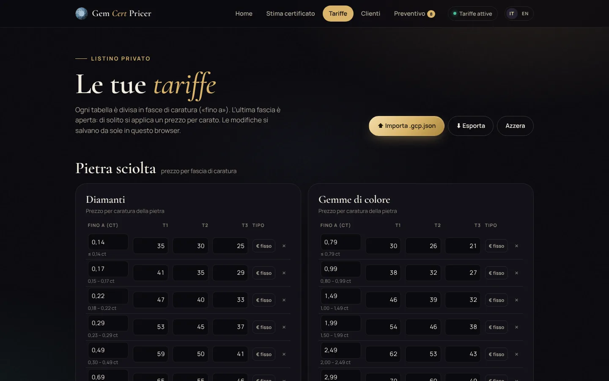
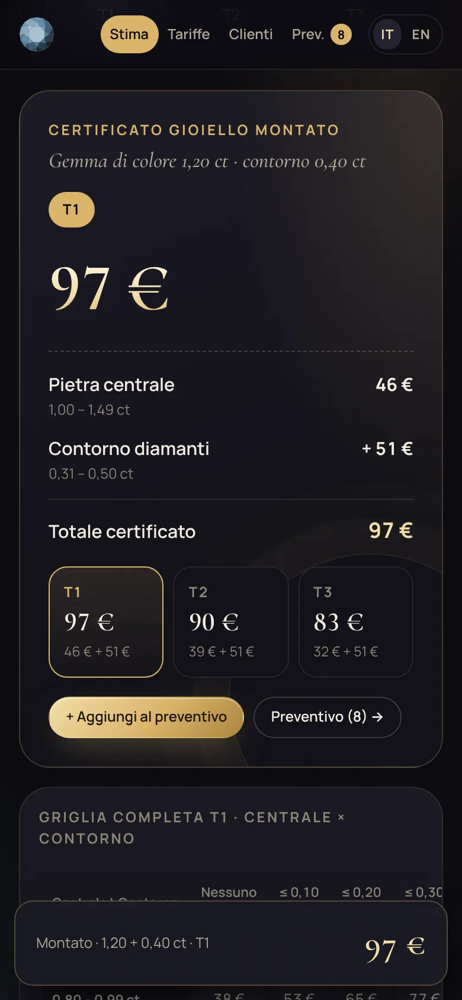

<div align="center">

# 💎 Gem Cert Pricer

**Stima istantanea del costo dei certificati gemmologici**

Strumento per gemologi e operatori del distretto orafo **Tarì** (Marcianise, Campania).
Pietre sciolte, gioielli montati (gemma di colore o lab-grown) e bracciali tennis.
Inserisci la caratura e confronta subito il prezzo del certificato sui tre tier T1 · T2 · T3.

[**▶ Apri l'app**](https://alessandro-sequino.github.io/gem-cert-pricer/)

🇮🇹 Italiano · 🇬🇧 English · 📱 Installabile come app (PWA) · 🔒 Tariffe private, mai nel repository

</div>

---

## Panoramica

Gem Cert Pricer è un'applicazione web **single-file** (un solo `index.html` con CSS e JavaScript inline, zero build, zero dipendenze JS) pensata per il lavoro al banco.

L'interfaccia è in **italiano e inglese**: la lingua si sceglie dal selettore IT/EN in alto, parte da quella del browser e viene ricordata.

Funziona interamente nel browser: **nessun server, nessun account, nessun dato che lascia il dispositivo**. Le tariffe vivono nel `localStorage` del browser e si spostano tra dispositivi con un file `.gcp.json`.

| Schermata | Descrizione |
|---|---|
| **Home** | Pagina iniziale con i tre percorsi di stima |
| **Stima certificato** | Pietra sciolta · Montato (gemma di colore o lab-grown) · Tennis, con confronto T1/T2/T3 e fasce evidenziate |
| **Tariffe** | Editor delle tabelle di prezzo, import/export `.gcp.json` |
| **Clienti** | Database clienti: tier di riferimento, prezzi su misura e link personale |

### Versione aziendale e versione pubblica

- **Aziendale** — chi importa il tariffario completo vede i tre tier, le tariffe e la pagina **Clienti**. A ogni cliente si assegna un tier e, se serve, un prezzo su misura per singola fascia (o per il supplemento della pietra centrale).
- **Pubblica (cliente)** — dalla scheda di un cliente si copia il suo **link personale**. Chi lo apre vede solo i propri prezzi, in un'unica colonna: niente tier, niente tariffe aziendali, niente altri clienti. Il listino resta salvato sul suo dispositivo finché non riceve un link aggiornato.

Il link contiene solo i prezzi effettivi di quel cliente e li trasporta nel frammento `#` dell'indirizzo, che il browser non invia al server. Dall'app aziendale il pulsante **Anteprima** mostra esattamente ciò che vedrà il cliente.

---

## 🖼 Schermate

> Le schermate usano un tariffario **dimostrativo**: i prezzi mostrati sono inventati.


<table>
  <tr>
    <td width="50%"><b>Pietra sciolta</b> — fascia di caratura evidenziata e confronto T1 · T2 · T3<br><br></td>
    <td width="50%"><b>Montato lab-grown</b> — peso totale dei diamanti + supplemento pietra centrale<br><br></td>
  </tr>
  <tr>
    <td width="50%"><b>Tennis</b> — fascia del peso totale, elenco compatto espandibile<br><br></td>
    <td width="50%"><b>Tariffe</b> — tabelle modificabili, import/export del tariffario privato<br><br></td>
  </tr>
</table>

**Montato con gemma di colore** — pietra centrale + contorno in diamanti, con la griglia completa centrale × contorno:


**Da smartphone** — layout ottimizzato con totale sempre visibile:

<p align="center">
  
  &nbsp;&nbsp;
  
</p>

---

## 📐 Come si calcola il prezzo

Ogni tabella è un elenco di **fasce di caratura** con limite superiore incluso («fino a»). L'ultima fascia è aperta e di norma usa un prezzo **per carato**. Ogni fascia ha un prezzo per ciascuno dei tre tier.

```
PIETRA SCIOLTA
  Cert = tariffa[diamante | gemma di colore][fascia caratura][tier]
         (ultima fascia: €/ct × caratura)

MONTATO — gemma di colore centrale + contorno in diamanti
  Cert = tariffa_centrale[fascia caratura centrale][tier]
       + supplemento_contorno[fascia caratura totale contorno][tier]
         (contorno = 0 ct → nessun supplemento)

PREZZO CLIENTE (versione pubblica)
  per ogni fascia: prezzo su misura del cliente, se presente,
                   altrimenti il prezzo del suo tier di riferimento

MONTATO LAB-GROWN
  Cert = tariffa_lab[fascia peso totale diamanti][tier]
       + supplemento pietra centrale[tier]   (solo se presente)

TENNIS — diamanti naturali
  Cert = tariffa_tennis[fascia peso totale diamanti][tier]
```

---

## 🔒 Tariffe separate dal codice

L'app è pubblicata **senza prezzi**: ogni operatore importa il proprio tariffario privato, che non finisce mai nel repository (`*.gcp.json` è in `.gitignore`). Il file aziendale contiene anche il database clienti: esportalo per farne una copia di sicurezza o spostarlo su un altro dispositivo.

```
1. Compila   →  pagina "Tariffe", oppure parti da sample-pricing.gcp.json
2. Esporta   →  "Esporta" scarica tariffario-AAAA-MM-GG.gcp.json
3. Importa   →  su qualsiasi dispositivo: "Importa .gcp.json"
```

### Formato `.gcp.json`

```json
{
  "format": "gcp-pricing-v2",
  "version": 2,
  "data": {
    "loose": {
      "diam":  [ {"max": 0.14, "t": [0, 0, 0]}, …, {"max": null, "t": [0, 0, 0], "perCt": true} ],
      "color": [ … ]
    },
    "mounted": {
      "center":    [ … ],
      "halo":      [ … ],
      "lab":       [ … ],
      "labCenter": [0, 0, 0]
    },
    "tennis": [ … ],
    "clients": [
      {"id": "…", "name": "Rossi Gioielli", "tier": 1, "note": "",
       "overrides": {"loose.diam": {"0.49": 35}, "mounted.labCenter": 9}}
    ]
  }
}
```

- `max` — limite superiore della fascia in ct (incluso); `null` = fascia aperta
- `t` — prezzi per T1, T2, T3
- `perCt` — `true` se il prezzo è in €/ct e va moltiplicato per la caratura
- `labCenter` — supplemento fisso per la pietra centrale nel montato lab-grown (T1, T2, T3)
- `clients` — database clienti: `tier` (0 = T1, 1 = T2, 2 = T3) e `overrides`, prezzi su misura indicizzati per tabella e limite della fascia (`"open"` per l'ultima fascia aperta)

I file del formato precedente (`gcp-pricing-v1`) non sono più compatibili.

---

## 🚀 Uso

**Online:** [alessandro-sequino.github.io/gem-cert-pricer](https://alessandro-sequino.github.io/gem-cert-pricer/)

**In locale:**

```bash
git clone https://github.com/Alessandro-Sequino/gem-cert-pricer.git
cd gem-cert-pricer
python3 -m http.server 8080      # poi apri http://localhost:8080
```

**Sul telefono (PWA):** Android/Chrome → menu ⋮ → *Aggiungi a schermata Home* · iPhone/Safari → Condividi → *Aggiungi a schermata Home*.

---

## 🗂 Struttura

```
gem-cert-pricer/
├── index.html              # L'intera applicazione (HTML + CSS + JS inline)
├── manifest.json           # Manifest PWA
├── icon-192.png / icon-512.png
├── sample-pricing.gcp.json # Template vuoto del tariffario
├── docs/screenshots/       # Schermate usate nel README (prezzi dimostrativi)
└── README.md
```

---

## Crediti

Creato da **Alessandro Sequino** · distretto orafo **Tarì**, Campania.

**Ultimo aggiornamento:** ottobre 2026
